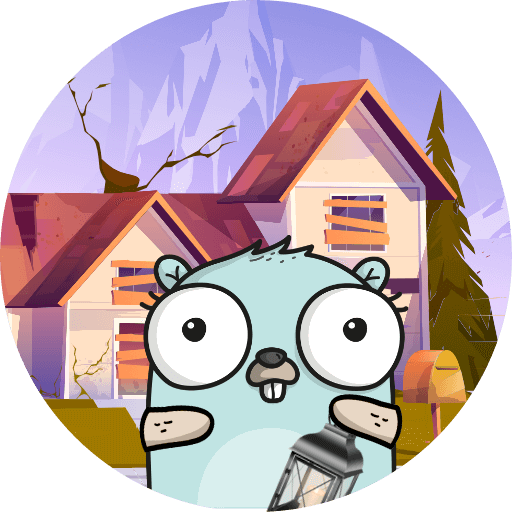

<p align="center">
  
</p>
<p align="center">A Zork I game ported from <a href="https://github.com/historicalsource/zork1" target="_blank">ZIL source</a> to Golang.</p>
<p align="center">
  <a href="https://goreportcard.com/report/github.com/ajdnik/gozork" target="_blank"></a>
</p>

## Description

Zork I is a 1980 interactive fiction game written by Marc Blank, Dave Lebling, Bruce Daniels and Tim Anderson and published by Infocom. To learn more about the history of the game feel free to read [Zork I: The Great Underground Empire](https://medium.com/@r.ajdnik/zork-the-great-underground-empire-cda94623861c) on Medium.

## Usage

Clone the git repository and build the go binary.

```bash
$ git clone https://github.com/ajdnik/gozork.git
Cloning into 'gozork'...
remote: Enumerating objects: 153, done.
remote: Counting objects: 100% (153/153), done.
remote: Compressing objects: 100% (109/109), done.
remote: Total 153 (delta 100), reused 92 (delta 43), pack-reused 0
Receiving objects: 100% (153/153), 1.16 MiB | 4.46 MiB/s, done.
Resolving deltas: 100% (100/100), done.

$ cd gozork

$ go build

$ ./gozork
ZORK I: The Great Underground Empire
Infocom interactive fiction - a fantasy story
Copyright (c) 1981, 1982, 1983, 1984, 1985, 1986 Infocom, Inc. All rights reserved.
ZORK is a registered trademark of Infocom, Inc.
Release 119 / Serial number 880429

West of House
You are standing in an open field west of a white house, with a boarded front door.
There is a small mailbox here.

>
```
