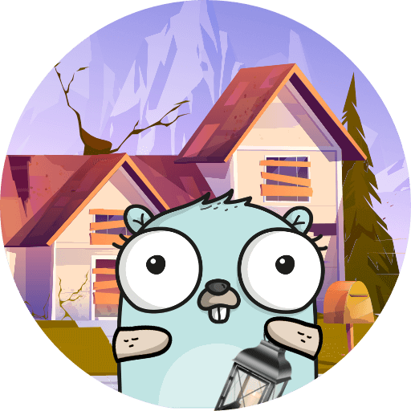

<p align="center">
  
</p>
<p align="center">A Zork I game ported from <a href="https://github.com/historicalsource/zork1" target="_blank">ZIL source</a> to Golang.</p>
<p align="center">
  <a href="https://goreportcard.com/report/github.com/ajdnik/gozork" target="_blank"></a>
</p>

## Description

Zork I is a 1980 interactive fiction game written by Marc Blank, Dave Lebling, Bruce Daniels and Tim Anderson and published by Infocom. To learn more about the history of the game feel free to read [Zork I: The Great Underground Empire](https://medium.com/@r.ajdnik/zork-the-great-underground-empire-cda94623861c) on Medium.

## Install

### Pre-built binary

Download the latest release for your platform from the [releases page](https://github.com/ajdnik/gozork/releases):

| Platform        | Archive                          |
|-----------------|----------------------------------|
| Linux amd64     | `gozork-linux-amd64.tar.gz`      |
| Linux arm64     | `gozork-linux-arm64.tar.gz`      |
| macOS amd64     | `gozork-darwin-amd64.tar.gz`     |
| macOS arm64     | `gozork-darwin-arm64.tar.gz`     |
| Windows amd64   | `gozork-windows-amd64.tar.gz`    |
| Windows arm64   | `gozork-windows-arm64.tar.gz`    |

Verify the checksum against `checksums-sha256.txt` included in the release.

**Linux / macOS:**

```bash
sha256sum -c checksums-sha256.txt --ignore-missing
```

**macOS (if `sha256sum` unavailable):**

```bash
shasum -a 256 -c checksums-sha256.txt --ignore-missing
```

**Windows (PowerShell):**

```powershell
$file = "gozork-windows-amd64.tar.gz"
$expected = (Select-String $file checksums-sha256.txt).Line.Split(" ")[0]
$actual = (Get-FileHash $file -Algorithm SHA256).Hash.ToLower()
if ($actual -eq $expected) { "OK" } else { "MISMATCH" }
```

Extract and run:

```bash
tar -xzf gozork-<os>-<arch>.tar.gz
./gozork
```

### go install

Requires Go 1.25+:

```bash
go install github.com/ajdnik/gozork@latest
gozork
```

### Build from source

```bash
git clone https://github.com/ajdnik/gozork.git
cd gozork
make run
```

## Usage

```
$ ./gozork
ZORK I: The Great Underground Empire
Infocom interactive fiction - a fantasy story
Copyright (c) 1981, 1982, 1983, 1984, 1985, 1986 Infocom, Inc. All rights reserved.
ZORK is a registered trademark of Infocom, Inc.
Release 119 / Serial number 880429

West of House
You are standing in an open field west of a white house, with a boarded front door.
There is a small mailbox here.

>
```

## Contributing

See [CONTRIBUTING.md](CONTRIBUTING.md).
